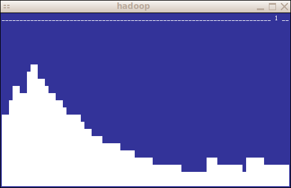

# cload

*cload* is a curses version of the excellently simple
*xload* program.  *cload* displays a graph of the system
load average over time.  The default update interval is 3 seconds,
which is easily changed by specifying the update interval as the
command's only argument.  A line at the top of the screen shows the
range of the Y-axis.

*cload* is licensed under the Gnu General Public License, version 2.
